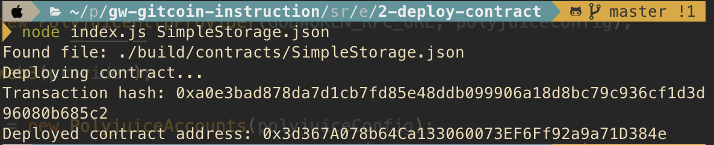

#### A screenshot of the console output immediately after you have successfully deployed a smart contract.

#### The transaction hash from the contract deployment (in text format).

0xa0e3bad878da7d1cb7fd85e48ddb099906a18d8bc79c936cf1d3d96080b685c2

#### The deployed contract address from the contract deployment (in text format).

0x3d367A078b64Ca133060073EF6Ff92a9a71D384e