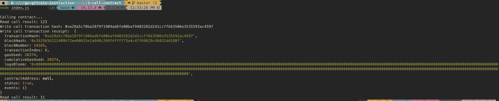

#### A screenshot of the console output immediately after you have successfully issued a smart contract call.




#### The transaction hash from the console output (in text format).

0xa28a5c78ba28f9f1904ad6fe80baf9403282d2d1ccffb63506e3535592ac4597

#### The contract address that you called (in text format).

0x3d367A078b64Ca133060073EF6Ff92a9a71D384e

#### The ABI for contract you made a call on (in text format).

```javascript
[
  {
    inputs: [],
    stateMutability: "payable",
    type: "constructor",
  },
  {
    inputs: [
      {
        internalType: "uint256",
        name: "x",
        type: "uint256",
      },
    ],
    name: "set",
    outputs: [],
    stateMutability: "payable",
    type: "function",
  },
  {
    inputs: [],
    name: "get",
    outputs: [
      {
        internalType: "uint256",
        name: "",
        type: "uint256",
      },
    ],
    stateMutability: "view",
    type: "function",
  },
]
```