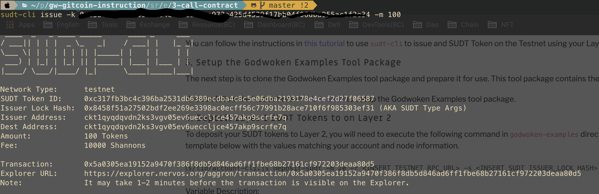

### A link to the Layer 1 address you funded on the Testnet Explorer.

https://explorer.nervos.org/aggron/address/ckt1qyqdqvdn2ks3vgv05ev6ueccljce457akp9scrfe7q

### A screenshot of the console output immediately after using sudt-cli to create your SUDT tokens on Layer 1.

### A link to the transaction ID created by sudt-cli on the Testnet Explorer.

https://explorer.nervos.org/aggron/transaction/0x5a0305ea19152a9470f386f8db5d846ad6ff1fbe68b27161cf972203deaa80d5

### A screenshot of the console output immediately after you have successfully submitted a deposit to Layer 2 using the account-cli tool.

#### The SUDT ID from the console output after executing the deposit script (in text format).

743