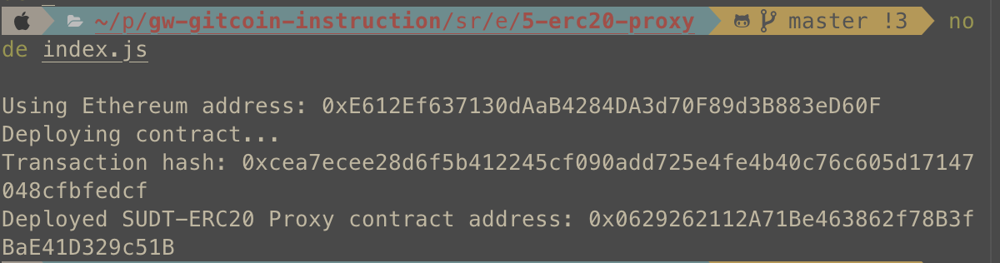
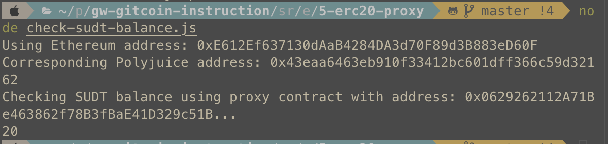

### A screenshot of the console output immediately after deploying smart contract.

### The address of the ERC20 Proxy Contract you deployed (in text format).

0x0629262112A71Be463862f78B3fBaE41D329c51B

### A screenshot of the console output immediately after checking your SUDT balance.

### The Ethereum address that was checked (in text format).

0xE612Ef637130dAaB4284DA3d70F89d3B883eD60F
