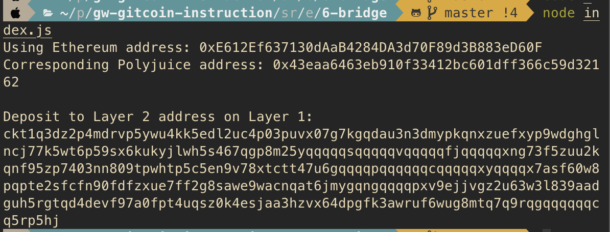

### A screenshot of the console output immediately after you have successfully generated your Deposit Receiver Address.




### Your Deposit Receiver Address (in text format).

```
ckt1q3dz2p4mdrvp5ywu4kk5edl2uc4p03puvx07g7kgqdau3n3dmypkqnxzuefxyp9wdghglncj77k5wt6p59sx6kukyjlwh5s467qgp8m25yqqqqqsqqqqqvqqqqqfjqqqqqxng73f5zuu2kqnf95zp7403nn809tpwhtp5c5en9v78xtctt47u6gqqqqpqqqqqqcqqqqqxyqqqqx7asf60w8pqpte2sfcfn90fdfzxue7ff2g8sawe9wacnqat6jmygqngqqqqpxv9ejjvgz2u63w3l839aadguh5rgtqd4devf97a0fpt4uqsz0k4esjaa3hzvx64dpgfk3awruf6wug8mtq7q9rqgqqqqqqcq5rp5hj
```

### The Ethereum address used to generate the Deposit Receiver Address (in text format).

```
0xE612Ef637130dAaB4284DA3d70F89d3B883eD60F
```

### A link to the Etherscan explorer for the successful Force Bridge transaction. This can be found on Force Bridge under History→Succeed.


https://rinkeby.etherscan.io/tx/0x72260b1e6da1641f8a840e28cf81a3c1762cbe02c23ec7916bf02362a817ea3b


### A link to the Nervos explorer for the successful Force bridge transaction. This can be found on Force Bridge under History→Succeed.

https://explorer.nervos.org/aggron/transaction/0x6c0f5ee9938e075f63e685a1e9b540d57aca5283352282293b4db513ba64a5ed