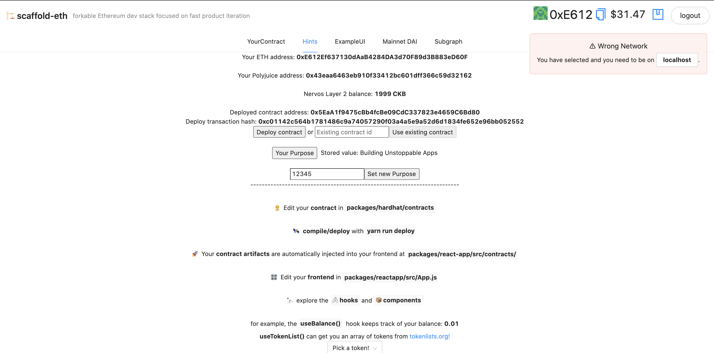

### Screenshots or video of your application running on Godwoken.

demo





### Link to the GitHub repository with your application which has been ported to Godwoken. This must be a different application than the one covered in this guide.

[repo](https://github.com/carmen0208/simple-eth-nervos-bridge)


### If you deployed any smart contracts as part of this tutorial, please provide 
the transaction hash of the deployment transaction, 

* Deploy transaction hash: 

```
0xc01142c564b1781486c9a74057290f03a4a5e9a52d6d1834fe652e96bb052552
```
* The deployed contract address:

```
0x5EaA1f9475cBb4fcBe09CdC337823e4659C6Bd80
```

* and the ABI of the deployed smart contract.

```
{
  "_format": "hh-sol-artifact-1",
  "contractName": "YourContract",
  "sourceName": "contracts/YourContract.sol",
  "abi": [
    {
      "inputs": [],
      "stateMutability": "nonpayable",
      "type": "constructor"
    },
    {
      "inputs": [],
      "name": "getPurpose",
      "outputs": [
        {
          "internalType": "string",
          "name": "",
          "type": "string"
        }
      ],
      "stateMutability": "view",
      "type": "function"
    },
    {
      "inputs": [
        {
          "internalType": "string",
          "name": "newPurpose",
          "type": "string"
        }
      ],
      "name": "setPurpose",
      "outputs": [],
      "stateMutability": "payable",
      "type": "function"
    }
  ]
}

```